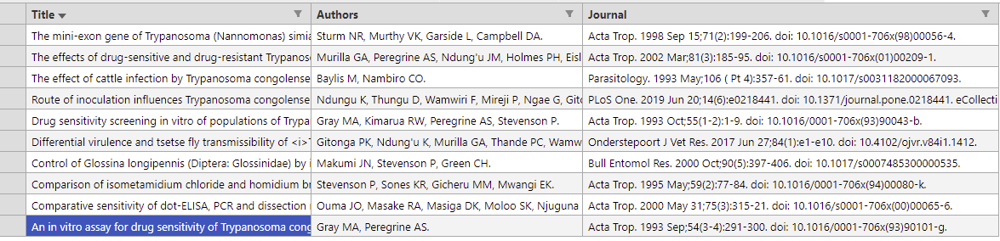

# Journal_article_finder
A bot for scrapping journal articles matching a provided search term. The program accepts a search term, and returns all the journal articles containing the search term, then writes the output to a csv file:
* Article Title
* Authors
* Journal name


## Installation
### Prerequisites
**Python** 
``` 
https://www.python.org/
```
**Selenium** 
```
pip install selenium 
```
**Chrome web driver**
* Check your chrome version
```
chrome://version
 ```
*  Download the chrome driver matching your version
 ```
 https://chromedriver.chromium.org/downloads
 ```

## Usage
* Clone this repo
  ```
   git@github.com:ckigenk/Journal_article_finder_bot.git
   ```
* Open [bot/constants.py](https://github.com/ckigenk/Journal_article_finder_bot/blob/main/bot/constants.py) and:
    * Replace the PATH value with the actual path to your chrome web driver

* Execute [main.py](https://github.com/ckigenk/Journal_article_finder_bot/blob/main/main.py)
  ```
  python main.py
  ```
* Enter a search term to the console as prompted by the program

## Sample output
**Screenshot of csv file containing journal article data** </img>
